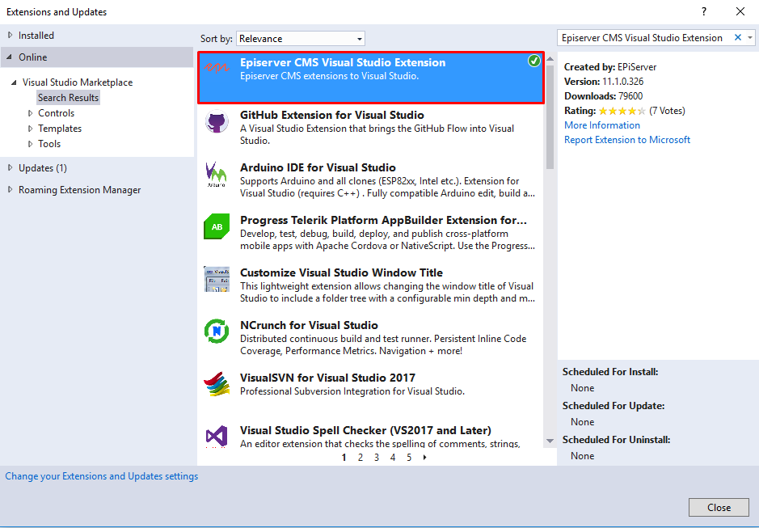

# Episerver - training

Episerver Development Fundumentals learning path

---

## Agenda

- [Module 1 - Getting Started](#module-a---getting-started)
  - [Extension for Visual Studio](#extension-for-visual-studio)
  - [Installing Alloy MVC site](#installing-alloy-mvc-site)
  - [Learn basic editing](#learn-basic-editing)
- [Module 2 - Pages, content types and properties](#module-b---pages-content-types-and-properties)
  - [Create a starter project](#create-a-starter-project)
  - [Media types and templates](#media-types-and-templates)
  - [Customizing the TinyMCE editor](#customizing-the-tinymce-editor)
  - [Navigation](#navigation)
  - [Create a page programmatically](#create-a-page-programmatically)
- [Module 3 - Rendering](#module-c---rendering)
  - [Create a partial template for the pages](#create-a-partial-template-for-the-pages)
  - [Create Display Channel for Mobile](#create-display-channel-for-mobile)
  - [Tag the partial template to only render in tagged content area](#tag-the-partial-template-to-only-render-in-tagged-content-area)
- [Module 4 - Blocks](#module-d---blocks)
  - [Create a Teaser Block](#create-a-teaser-block)
  - [Create a Preview Renderer for Blocks](#create-a-preview-renderer-for-blocks)
  - [Use a Block as a property](#use-a-block-as-a-property)
- [Module 5 - Listing & Menu Controls](#module-e---listing--menu-controls)
  - [Create a Page Listing Block](#create-a-page-listing-block)
  - [Create News Page & News Items](#create-news-page--news-items)
- [Module 6 - Search & Filter](#module-f---search--filter)
  - [Search by page properties](#search-by-page-properties)
  - [Full-text search](#full-text-search)
- [Module 7 - Administration tools](#module-g---administration-tools)
  - [Create new administrator user](#create-new-administrator-user)
  - [Scheduled jobs](#scheduled-jobs)
  - [Create Admin Plugin](#create-admin-plugin)
  - [Create custom report](#create-custom-report)
  - [Administration UI](#administration-ui)

---

## Module A - Getting Started

- ### **Extension for Visual Studio**

  Install 'Episerver CMS Visual Studio Extension'
  

  >**Useful links:**
  >
  ><https://world.episerver.com/download/Items/Episerver-CMS/Episerver-75-CMS/visual-studio-cms-extensions/>
  >
  ><https://marketplace.visualstudio.com/items?itemName=EPiServer.EpiserverCMSVisualStudioExtension>

- ### **Installing Alloy MVC site**

  Install Alloy MVC site

  

  >**Notes:**
  > Change search to 'Episerver Search'

  Please be aware that Alloy is not always an example of "best practices", more an example of what you CAN do rather than what you SHOULD do.

  Alloy has quite a lot of examples of special content rendering, however there are no documentation on why, how or exactly which code is related to which functionality.

  The articles below helps to better understand Allow template.

  >**Useful links:**
  >
  ><https://world.episerver.com/documentation/Items/Installation-Instructions/installing-episerver/>
  >
  ><https://world.episerver.com/articles/Items/ASPNET-MVC-Templates-for-EPiServer-7-CMS/>
  >
  ><https://world.episerver.com/Articles/Items/Alloy-Templates-for-EPiServer-CMS-7/>
  >
  ><http://joelabrahamsson.com/episerver-and-mvc-what-is-the-view-model/>

- ### **Learn basic editing**

  > **Alloy template should be used to learn editing concept**

  Read the manual below

  >**Useful links:**
  >
  ><https://world.episerver.com/documentation/developer-guides/CMS/getting-started/learn-basic-editing/>
  >
  ><http://webhelp.episerver.com/latest/getting-started/user-interface.htm>
  >
  ><http://webhelp.episerver.com/latest/getting-started/on-page-edit-view.htm>
  >
  ><http://webhelp.episerver.com/latest/cms-admin/administration-view.htm>
  >
  ><http://webhelp.episerver.com/latest/getting-started/logging-in.htm>
  >
  ><http://webhelp.episerver.com/latest/cms-edit/managing-content.htm>
  >
  ><http://webhelp.episerver.com/latest/cms-admin/access-rights.htm>

## Module B - Pages, content types and properties

- ### Create a starter project

  Create new site with next structure:
  - Start page (StartPage type)
  - Article page 1 (ArticlePage type)
  - Article page 2 (ArticlePage type)
  - Pages should inherit functionality from base page:
  - Robots (string)
  - OpenGraphTitle (string)
  - OpenGraphMedia (ContentReference)
  - Article page type should has 'XHTML string' property
  
  **Tasks:**
  
  - Use empty template for this project
  - Start page must be configured as start page for the site (Manage Websites in the application admin page)
  - Generate and add license file
  - Base layout should be created (render data for metadata)

  >**Useful links:**
  >
  ><https://world.episerver.com/documentation/developer-guides/CMS/getting-started/creating-a-starter-project/>
  >
  >[Create new administrator user](#Create-new-administrator-user)
  >
  ><https://docs.microsoft.com/en-us/aspnet/core/mvc/views/overview>
  >
  ><https://world.episerver.com/documentation/developer-guides/CMS/Content/Attributes/>

- ### Media types and templates

  **Tasks:**

  1. Create type for images (Copyright and Description fields)
  2. Create separate type for documents (Description field)
  3. Changing the maximum upload file size

  >**Useful links:**
  >
  ><https://world.episerver.com/documentation/developer-guides/CMS/Content/assets-and-media/Media-types-and-templates/>

- ### Customizing the TinyMCE editor

  **Tasks:**
  
  1. Add 'Edit HTML Source' button
  2. Change styles drop down
  3. Localize a styles menu
  4. Check in edit mode with different UI language that localization of the TinyMCE dropdown editor works.

  >**Useful links:**
  >
  ><https://world.episerver.com/documentation/developer-guides/CMS/add-ons/customizing-the-tinymce-editor-v2/>

- ### Navigation

  **Tasks:**
  
  1. Add simple menu and navigation
  2. Menu should contains two levels
  3. Include menu model to layout model (implement IResultFilter)  
     (to avoid population in each page controller)
  
  Example of navigation menu implementation could be found in EPiServer demo project(Alloy) or check jondjones.com (could   be found in useful links below)

  >**Useful links:**
  >
  ><http://jondjones.com/learn-episerver-cms/episerver-developers-guide/common-web-page-component-tutorials/how-to-create-a-mega-menu-in-episerver>

- ### Create a page programmatically

  **Tasks:**
  
  1. Create new page **programmatically**  under start page
  2. Update any field on the existing article page by clicking on button

  >**Useful links:**
  >
  ><http://jondjones-website.azurewebsites.net/learn-episerver-cms/episerver-developers-guide/importing-content-into-episerver-programmatically/how-to-create-a-page-programmatically-in-episerver>
  >
  ><https://world.episerver.com/documentation/developer-guides/CMS/Content/Creating-a-page-programmatically/>
  >
  ><https://world.episerver.com/documentation/developer-guides/CMS/initialization/Creating-an-initialization-module/>

## Module C - Rendering

- ### Create a partial template for the pages

  **Tasks:**
  
  1. Add a Content Area to the Start Page.
  2. Create Partial View and Controller for the ContentPage.  
  Note. ContentPage must be used as normal page and in ContentArea on StartPage
  
  >**Useful links:**
  >
  ><http://www.jondjones.com/learn-episerver-cms/episerver-developers-guide/episerver-content-areas/how-to-a-render-a-page-in-a-content-area-as-a-partial>

- ### Create Display Channel for Mobile

  **Tasks:**
  
  1. Register new Mobile Channel.
  2. Create special mobile template for a page.
  3. Check that a page is rendering using new template in preview mode when "mobile" channel is selected.
  
  >**Useful links:**
  >
  >[https://world.episerver.com/documentation/developer-guides/CMS/rendering/display-channels/](https://world.episerver.com/documentation/developer-guides/CMS/rendering/display-channels/)

- ### Tag the partial template to only render in tagged content area

  **Tasks:**
  
  1. Add second Content Area to the Start Page.
  2. Render content area with specific tag.
  3. Create partial template for a page which is displayed only in content area with specific tag.
  
  >**Useful links:**
  >
  ><https://world.episerver.com/documentation/developer-guides/CMS/rendering/selecting-templates/>
  >
  ><https://world.episerver.com/documentation/developer-guides/CMS/rendering/templatedescriptor-and-tags/>

## Module D - Blocks

- ### Create a Teaser Block

  **Tasks:**
  
  1. Add a block type using vs extension.
  2. Add Title, Description and Image properties to the block.
  3. Add partial view for the block.
  4. Create a shared block instance based on the new block type.
  5. Add shared block to the content area on the start page.
  
  >**Useful links:**
  >
  ><http://www.jondjones.com/learn-episerver-cms/episerver-developers-guide/episerver-blocks/episerver-blocks-a-quick-reference-guide>
  >
  ><https://world.episerver.com/documentation/developer-guides/CMS/Content/Block-types-and-templates/>

- ### Create a Preview Renderer for Blocks

  **Tasks:**
  
  1. Create a preview controller for block.
  2. Create a preview template for blocks.
  
  >**Useful links:**
  >
  ><https://world.episerver.com/documentation/developer-guides/CMS/rendering/preview-rendering-for-blocks/>
  >
  ><http://www.jondjones.com/learn-episerver-cms/episerver-developers-guide/episerver-blocks/how-to-preview-a-block-in-episerver>

- ### Use a Block as a property

  **Tasks:**
  
  1. Add a local block to the StandardPage type.
  2. Add rendering of the local block to the corresponding page template.
  3. Populate the block in edit mode and check how it is rendered.
  
  >**Useful links:**
  >
  ><https://world.episerver.com/documentation/developer-guides/CMS/Content/Properties/using-a-block-as-a-property/>
  >
  ><http://joelabrahamsson.com/working-programmatically-with-local-blocks-in-episerver-7/>

## Module E - Listing & Menu Controls

- ### Create a Page Listing Block

  **Tasks:**
  
  1. Add a new Block Type with "Root" property.
  2. Create the Block template.

- ### Create News Page & News Items

  **Tasks:**
  
  1. Add a News Page page type.
  2. Create new Layout with left navigation for child pages.
  3. News page should allow to create only News Item pages under it.  
  
  >**Useful links:**
  >
  ><https://world.episerver.com/documentation/developer-guides/CMS/Content/Attributes/>

## Module F - Search & Filter

- ### Search by page properties

  **Tasks:**
  
  1. Create a new "PageList" block which can display pages of specific type under a specific content root node recursively.  
  Use PageCriteriaQueryService to implement search functionality.  
  Create an instance of the block to display list of all news articles under specific news list page.  
  2. Compare FindPagesWithCriteria with FindAllPagesWithCriteria method of the PageCriteriaQueryService.  
  Create a job to show a list of all unpublished news articles on the site in the job result.
  
  >**Useful links:**
  >
  ><http://jondjones.com/learn-episerver-cms/episerver-developers-guide/episerver-api-explained/findpageswithcriteria-how-to-search-for-pages-within-episerver>
  >
  ><https://world.episerver.com/documentation/developer-guides/CMS/search/Searching-for-pages-based-on-page-type/>

- ### Full-text search

  **Tasks:**
  
  1. Add new page type and a template for the Search page.
  2. Implement search logic in a new SearchService using out the box Episerver.Search functionality.  
  Search should be able to find pages and media files in a specific language by text search query .
  3. Additionally implement the same search logic using Episerver.Find.
  
  >**Useful links:**
  >
  ><http://www.jondjones.com/learn-episerver-cms/episerver-developers-guide/episerver-search/how-to-set-up-and-install-the-episerver-search>
  >
  ><http://jondjones.com/learn-episerver-cms/episerver-developers-guide/episerver-search/how-to-make-a-site-search-in-episerver>
  >
  ><http://jondjones.com/learn-episerver-cms/episerver-developers-guide/episerver-search/review-of-the-different-search-providers-available-to-use-on-your-episerver-project>
  >
  ><https://world.episerver.com/documentation/developer-guides/CMS/search/>
  >
  ><https://world.episerver.com/documentation/developer-guides/find/>

## Module G - Administration tools

- ### Create new administrator user

  **Tasks:**
  
  >Note! You can skip points a and d if you have Administrator account and able to access admin interface.
  
  1. Add new user to the existing database
      1. Disable authorization by changing web.config file
      2. Create WebAdmins and WebEditors Roles if they doesn't exists
      3. Create new user and assign him WebAdmins and WebEditors Roles
      4. Revert web.config to previous state
  
  >**Useful links:**
  >
  ><http://webhelp.episerver.com/17-5/cms-admin/managing-users-groups.htm>
  >
  ><https://www.dcaric.com/blog/episerver-how-to-create-admin-users-from-the-code>

- ### Scheduled jobs

  **Tasks:**
  
  1. Create Scheduled jobs with cancel possibility
  2. Setup initial parameters (schedule) for the job
  
  >**Useful links:**
  >
  ><https://world.episerver.com/documentation/developer-guides/CMS/scheduled-jobs/>

- ### Create Admin Plugin

  **Tasks:**
  
  1. Create custom plugin for administration area using MVC
  2. Add button with EPiServer styles to the admin plugin
  
  >**Useful links:**
  >
  ><https://www.dcaric.com/blog/episerver-how-to-create-gui-plugins-using-mvc>
  >
  ><https://www.epinova.no/en/blog/creating-a-consistent-look-in-episerver-plugins/>

- ### Create custom report

  **Tasks:**
  
  1. Create custom report
  
  >**Useful links:**
  >
  ><https://world.episerver.com/blogs/Henrik-Fransas/Dates/2016/3/create-custom-report-in-mvc-with-excel-export/>

- ### Administration UI

  **Tasks:**
  
  1. Localize Tabs
  2. Localize property name
  3. Localize Scheduler job name and description
  4. Change page icon in the tree (UI descriptors)
  5. Change tabs order using ITabDefinitionRepository and GroupDefinitions attribute. What is the difference between these two ways.
  
  >**Useful links:**
  >
  ><https://world.episerver.com/documentation/developer-guides/CMS/globalization/localizing-the-user-interface/>
  >
  ><https://world.episerver.com/documentation/Items/Developers-Guide/Episerver-CMS/9/Content/grouping-content-types-and-properties/>
  >
  ><https://world.episerver.com/documentation/developer-guides/CMS/user-interface/Describing-content-in-the-UI/>
  >
  ><http://www.iceninemedia.com/articles/build-an-episerver-cms-9-initialization-module-to-sort-custom-model-tabs/>

## Ideas for further studying

- Change property name and create migration step  
- Create several templates for one content (Block or Page)  
- Add a block preview template (also implement default preview for all blocks)  
- Working with shared blocks programmatically (create and initialize properties)  
- Working with media data programmatically (import images, BLOBs provider)  
- Store data in the Dynamic Data Store (DDS)
